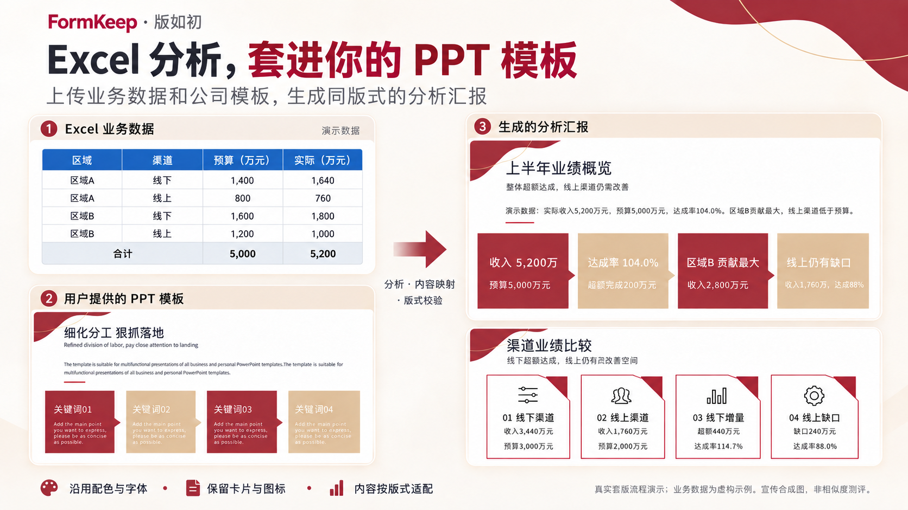
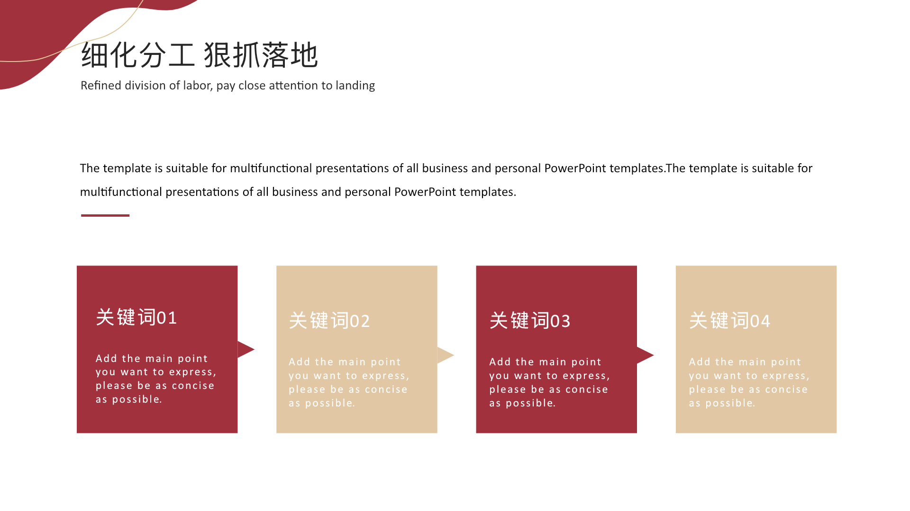
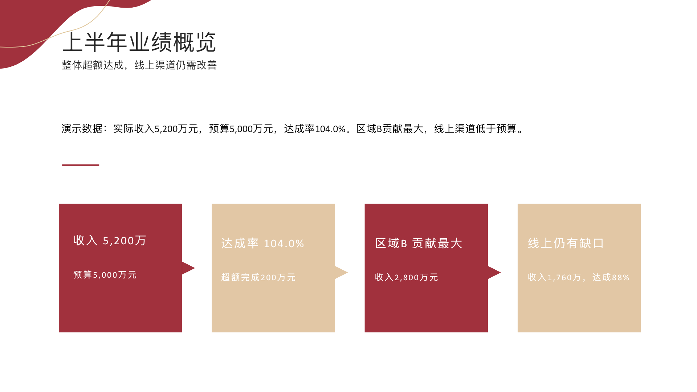
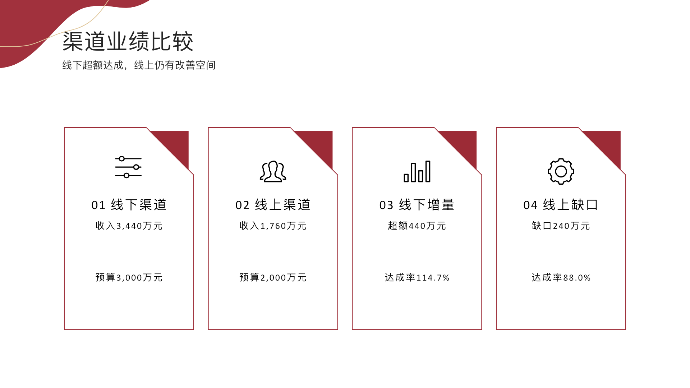

# FormKeep · 版如初

### 把内容套进你的 Office 模板，版式仍如初

An agent skill for applying business content to existing PPTX, DOCX, and XLSX templates—while preserving their layout, visual style, and editable structure.



> **MVP / 实验阶段。** 上图是基于实际套版流程制作的宣传合成图，所有业务数据均为虚构示例。下方提供直接渲染的页面用于比较。FormKeep 是 Skill 和辅助脚本，不是独立的在线编辑器，也不承诺任意模板绝不跑版。

## 一个真实的办公场景

FormKeep 面向需要明确格式的办公交付：根据业务、汇报、求职、公文或数据呈现等目标，将新内容套入用户指定的 Office 模板。它覆盖 PPTX、DOCX 和 XLSX；下面的 Excel 数据分析到 PPT 汇报是一个代表性案例，不是能力边界。

“这份 Excel 是区域与渠道业绩数据。请分析预算达成与业务差异，再用我提供的公司 PPT 模板做汇报。配色、字体、卡片和图标都要沿用模板。”

FormKeep 为代理提供套版约束：先整理事实与分析结论，再注册模板中的可编辑区域，按区域容量组织内容，最后检查样式变化和版式。Excel 分析和原生 Office 渲染需要运行环境提供相应工具。

| 用户提供的模板页 | 填入演示分析后的页面 |
| --- | --- |
|  |  |

两张图是直接渲染的页面，不是宣传图重绘。保留了左上角装饰、红金配色、四卡片布局和层级。结果页的业务名称和数字为虚构内容，截图不代表 PowerPoint 原生渲染验收。

<details>
<summary>再看一页：沿用原有卡片与图标的渠道比较</summary>



</details>

演示数据可在 [案例说明](docs/case-study.md) 中核对：预算 5,000 万元，收入 5,200 万元，达成率 104.0%。原始业务工作簿、完整模板和客户汇报不随仓库发布。

## 核心机制

- **模板说明书**：提取 PPTX 颜色引用、字体、对象几何、图层顺序、锚点及资源指纹，先约束视觉语言再填内容。
- **明确的内容槽位**：用稳定对象标识关联结构与模板。未标记模板需要先注册，不盲猜替换区域。
- **双向容量约束**：每个槽位配置最小内容量、推荐/硬性上限、行数和可用布局状态。字符数只是预检，还要校准字体和实际渲染。
- **版式优先适配**：在批准的边界内先拓宽文本框，再统一调整字号或使用紧凑版式。事实不可为了排版而改写，正文不能被悄悄截断。
- **风格检查与交付门槛**：新增元素需要同类样式来源。超出配色、破坏锁定元素、缺少渲染证据，都不能用一个高总分掩盖。

## 支持范围与限制

| 能力 | 当前范围 |
| --- | --- |
| PPTX | 命名形状槽位的纯文本填充；视觉说明书与结构样式审计 |
| DOCX | 内容控件槽位的纯文本填充；需要目标编辑器校验分页与布局 |
| XLSX | 指向单个单元格的命名槽位纯文本填充；不是通用公式/图表写入器 |
| 可视化双向映射 | 提供结构规范与实现指导；不附带完整可视化编辑器 |
| 字体替代、扩框、缩字 | Skill 要求记录并验证；当前填充脚本不会自动执行所有适配 |
| Excel 分析与 PPT 图表 | 由代理配合外部表格/演示文稿工具完成，不由填充 CLI 自动完成 |
| 原生渲染 | 需要用户环境提供 PowerPoint/Word/Excel 等目标引擎，仓库不包含渲染器 |

**90/100 指什么？** 这是可配置工作流中的结构样式保真门槛：配色 25、字体 20、布局 25、资源 20、形状样式 10。每页及整体都须过线，且不能触犯红线。它不是像素相似度、感知相似度或跨模型成功率。没有原生视觉复核时，审计会返回 `needs-native-render-review`，不得宣称已保证不跑版。

主题继承、复杂组合变换、字体可用性等仍需人工或目标引擎复核。详细规则见 [visual-contract.md](references/visual-contract.md)。

## 使用

将整个仓库作为名为 `formkeep` 的 Skill 文件夹，放入支持 `SKILL.md` 的代理环境。保留 `scripts/`、`references/`、`assets/` 和 `agents/` 的相对目录关系。不同宿主的发现与安装方式可能不同。

示例提示词：

```text
使用 $formkeep，分析我上传的 Excel 业绩数据，
并使用我上传的 PPT 模板生成分析汇报。
先建立模板视觉说明书和内容槽位，再确认容量与适配边界。
沿用模板配色、字体、图标与布局。遇到无法安全容纳的内容，
明确说明冲突，不截断数据、不擅自重设计。
```

### 辅助 CLI

辅助脚本使用 Python 3.10+ 标准库，不需要模型 API Key。脚本本身不执行网络请求；代理宿主如何处理上传内容取决于其配置，不能据此推断整个工作流离线。

```bash
# 对已标记的模板生成槽位清单；此时还未完成容量校准
python3 scripts/office_template.py inspect TEMPLATE.pptx --to template-spec.json

# 提取视觉说明书（JSON 与 Markdown）
python3 scripts/pptx_style_guard.py extract TEMPLATE.pptx --to template-visual.json

# 完成模板注册与校准后，验证并填充
python3 scripts/office_template.py validate template-spec.json bindings.json
python3 scripts/office_template.py fill TEMPLATE.pptx template-spec.json bindings.json draft.pptx --visual-book template-visual.json

# 所有适配、图表编辑和导出完成后，审计最终文件
python3 scripts/pptx_style_guard.py audit TEMPLATE.pptx final.pptx --plan style-plan.json --review render-review.json --to style-audit.json
```

`style-plan.json` 和 `render-review.json` 需要按 [视觉约束规范](references/visual-contract.md) 编制，不能伪造通过证据。原生复核记录与最终文件哈希绑定。`assets/` 中的示例未经真实模板校准，不能直接当成可交付配置。

## 开发与验证

```bash
python3 -m unittest discover -s scripts -p 'test_*.py' -v
```

测试覆盖槽位定位、容量约束和样式审计中的关键拒绝条件；不替代 Office 渲染或跨模型行为测试。

主要入口：[Skill 执行规则](SKILL.md)、[格式支持](references/format-support.md)、[结构规范](references/template-spec.md)、[交付检查](references/quality-gates.md)。

## 隐私与发布范围

仓库仅包含 Skill、辅助脚本、虚构示例与经过内容检查的静态演示图。不要在 issue、提交或截图中上传客户数据、访问凭据、未授权模板、字体文件或带个人路径的运行日志。完整模板及相关视觉素材的权利归原权利人；公开截图不构成模板再分发授权。

当前未附带开源许可证，请勿将“公开仓库”解读为已获得任意使用或再分发授权。
